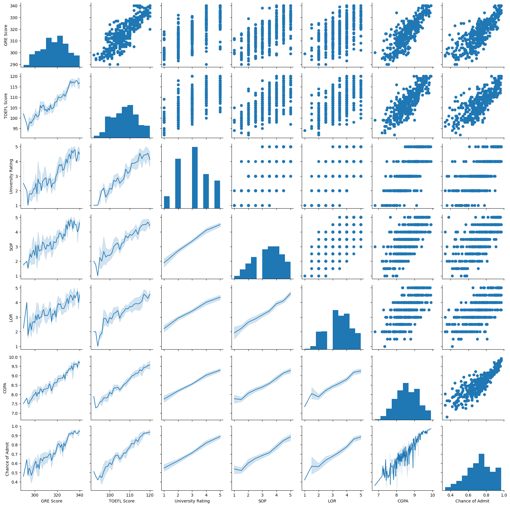
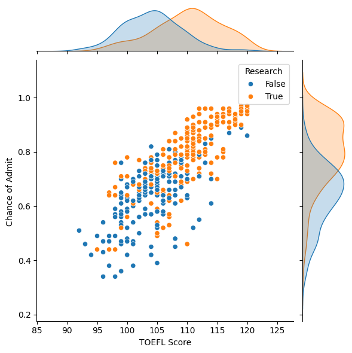
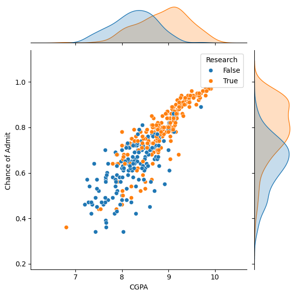
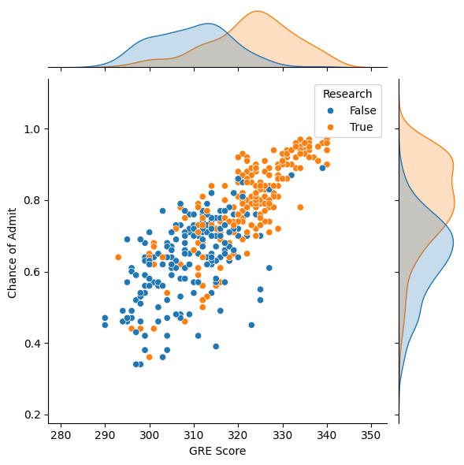
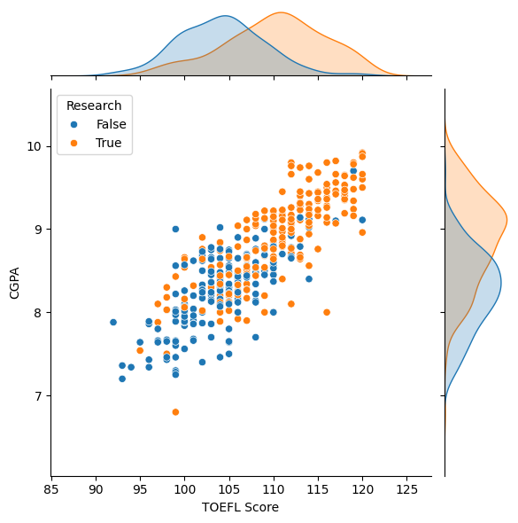

# Trabalho de Introdução aos Sistemas Inteligentes

**Arthur Henrique Chaves Oliveira**  
**Sophia Neves Alvim Ottoni**  
**Lucas Rodrigues Caetano Matos**

## Sumário

1. [BASE DE DADOS](#base-de-dados)
   1. [Dicionário de dados](#dicionário-de-dados)
   2. [Redução da base de dados](#redução-da-base-de-dados)
   3. [Resultado](#resultado)
2. [O PROBLEMA](#o-problema)
3. [ANÁLISE EXPLORATÓRIA](#análise-exploratória)
   1. [Admissão maior que 90%](#admissão-maior-que-90)
   2. [TOEFL acima e abaixo da mediana](#toefl-acima-e-abaixo-da-mediana)
      1. [Acima da mediana](#acima-da-mediana)
      2. [Abaixo da mediana](#abaixo-da-mediana)
   3. [CGPA acima ou abaixo da mediana](#cgpa-acima-ou-abaixo-da-mediana)
      1. [Acima da mediana](#cgpa-acima-da-mediana)
      2. [Abaixo da mediana](#cgpa-abaixo-da-mediana)
4. [GRÁFICOS](#gráficos)
   1. [Gráfico geral](#gráfico-geral)
   2. [Gráfico baseado em Chance of Admit](#gráfico-baseado-em-chance-of-admit)
      1. [TOEFL](#toefl)
      2. [CGPA](#cgpa)
      3. [GRE Score](#gre-score)
   3. [Gráfico baseado no TOEFL](#gráfico-baseado-no-toefl)
      1. [CGPA](#cgpa-2)
      2. [GRE Score](#gre-score-2)
5. [CONCLUSÃO](#conclusão)

## BASE DE DADOS

Para a realização deste trabalho foi decidido a utilização da base de dados “Data for Admission in the University”. Esta base de dados fornece informações sobre diversos alunos, como: GRE Scores,  TOEFL score, university rating, etc; além da chance que eles possuem de serem admitidos nas universidades. Ela possui 400 dados de diferentes alunos.

### Dicionário de dados

A tabela original apresenta um total de 9 dados, sendo eles: Serial Number,GRE score, TOEFL score, University Rating, SOP, LOR, CGPA, Research e Chance of Admit.

| Coluna/Atributo   | Tipo de dado           | Descrição |
|-------------------|------------------------|-----------|
| Serial Number     | Números Inteiros (int) | Dado que nos informa o índice da pessoa referente a linha, ele vai de 1 a 400. |
| GRE score         | Inteiro                | Atributo que guarda a nota obtida pelo aluno no GRE (Graduate Record Examination), indo de 0 a 340. |
| TOEFL score       | Inteiro                | Atributo que nos informa a nota obtida pelo aluno no TOEFL (Test of English as a Foreign Language), os valores desta coluna variam entre 0 e 120. |
| University Rating | Categórico ordinal     | Define a qualidade da universidade em que o aluno está tentando passar. Os dados dessa coluna vão de 1 a 5, sendo: 1 - qualidade muita baixa, 2 - qualidade baixa, 3 - qualidade razoável, 4 - qualidade boa, 5 - qualidade muito boa. |
| LOR               | Categórico ordinal     | Atributo que informa a qualidade da Letter of Recommendation que foi enviado à universidade. Esse atributo varia de 1 a 5 (1, 1.5, 2, 2.5, ..., 5), sendo valores mais próximos de 1 uma qualidade ruim e valores mais próximos de 5 uma qualidade boa. |
| SOP               | Categórico ordinal     | Atributo que guarda a qualidade do Statement of Purpose que foi enviado à universidade. Esse atributo varia de 1 a 5 (1, 1.5, 2, 2.5, ..., 5), sendo valores mais próximos de 1 uma qualidade ruim e valores mais próximos de 5 uma qualidade boa. |
| Research          | Booleano               | Define se a pessoa referência já participou de pesquisas ou não. |
| CGPA              | Número Real (float)    | Dado que informa o valor do Undergraduate Grade Point Average do aluno, esse valor varia de 1 a 10. |
| Chance of Admit   | Percentual             | Atributo que guarda a chance do aluno passar na universidade escolhida, esse valor está em porcentagem. |

### Redução da base de dados

Após uma análise dos atributos presentes na tabela foi-se considerado desnecessário a presença do atributo “Serial Number”, portanto sua remoção foi feita por meio de um código em python.

### Resultado

Tendo sido feita a redução de atributos a base de dados fica desta forma:

Fonte: tabela modificada pelos autores

## O PROBLEMA

Nos dias atuais diversos alunos querem realizar um curso de mestrado no exterior, no entanto muitos deles não sabem o que é necessário fazer para poder entrar, ou o quão bem eles precisam ir nos testes para poder passar. Pensando nisso, o nosso projeto busca identificar quais atributos possuem uma maior influência na chance de uma pessoa ser admitida no mestrado de uma determinada universidade.

Tendo como exemplo um aluno que teve seu CGPA baixo, um dado que não poderia ser alterado a não ser que seja realizada uma nova graduação, deveria então focar em outros campos para poder ter uma maior chance de admissão. Ele então poderia utilizar de nossos resultados para procurar os pontos de melhoria precisos.

## ANÁLISE EXPLORATÓRIA

Uma análise estatística da tabela se torna necessária para podermos tirar conclusões sobre a mesma. Esta análise seria feita por meio das médias, medianas, e modas dos atributos, esses valores são obtidos pela utilização de um código em python.

Tabela 1 - Análise da média, mediana, moda, valores máximos e mínimos dos atributos da base de dados

| Coluna/Atributo   | Média  | Mediana | Moda     | Máx  | Min  |
|-------------------|--------|---------|----------|------|------|
| GRE score         | 316.8  | 317     | 312; 324 | 340  | 290  |
| TOEFL score       | 107.41 | 107     | 110      | 120  | 92   |
| University Rating | 3.08   | 3       | 3        | 5    | 1    |
| LOR               | 3.45   | 3.5     | 3        | 5    | 1    |
| SOP               | 3.4    | 3.5     | 3.5; 4   | 5    | 1    |
| CGPA              | 8.59   | 8.61    | 8        | 9.92 | 6.8  |
| Chance of Admit   | 72.43% | 73%     | 64%      | 97%  | 34%  |

Fonte: elaborada pelos autores

Com uma análise da tabela é possível notar uma separação muito grande entre os valores mínimos e máximos dos atributos, além de valores de média e mediana sempre muito próximos. 

Para podermos analisar ainda mais a fundo os valores obtidos foi feita uma separação dos dados pela mediana e faixa de valores de alguns deles, resultando em algumas categorias de dados, sendo elas: pessoas com a chance de admissão maior que 90%, pessoas que tiveram o TOEFL acima e abaixo da mediana, pessoas com o CGPA abaixo e acima da mediana.

### Admissão maior que 90%

A separação das pessoas que possuíam uma chance maior ou igual a 90% melhora a visualização de possíveis padrões em quem possui a maior chance de ser admitido em uma universidade, como por exemplo o fato de os valores de CGPA estarem todos acima de 9.16, ou o fato da moda do GRE para essa faixa de valores ser igual a 340.

Tabela 2 - Análise da média, da mediana, moda, valores máximos e mínimos dos atributos das pessoas que tiveram uma chance de admissão >= 90%

| Coluna/Atributo   | Média  | Mediana | Moda     | Máx  | Min  |
|-------------------|--------|---------|----------|------|------|
| GRE score         | 333.24 | 334     | 340      | 340  | 320  |
| TOEFL score       | 116.26 | 116     | 118      | 120  | 110  |
| University Rating | 4.56   | 5       | 5        | 5    | 2    |
| LOR               | 4.42   | 4.5     | 4.5      | 5    | 3    |
| SOP               | 4.3    | 4.5     | 4.5      | 5    | 3    |
| CGPA              | 9.49   | 9.5     | 9.65     | 9.92 | 9.16 |

Fonte: elaborada pelos autores

### TOEFL acima e abaixo da mediana

Através da separação da base entre pessoas que a nota do TOEFL estava abaixo ou acima do valor da mediana do mesmo atributo pode nos dar uma ideia do quão importante é ter um inglês bem desenvolvido.

#### Acima da mediana

Após a separação dos dados e da aplicação de métodos de estatística podemos notar alguns fatos sobre as pessoas que tiveram uma nota acima da mediana, sendo eles: o aumento nos valores de quase todas as estatísticas em relação à tabela geral e que o valor da moda do GRE é a mesma da tabela geral, o que indica que a maioria dos dados tiveram o valor do TOEFL acima da mediana.

Tabela 3 - Análise da média, da mediana, moda, valores máximos e mínimos dos atributos das pessoas que tiveram uma pontuação no TOEFL maior que o valor da mediana
| Coluna/Atributo   | Média  | Mediana | Moda     | Máx  | Min  |
|-------------------|--------|---------|----------|------|------|
| GRE score         | 322.33 | 322     | 320      | 340  | 310  |
| TOEFL score       | 113.02 | 113     | 113      | 120  | 108  |
| University Rating | 3.66   | 4       | 4        | 5    | 1    |
| LOR               | 3.86   | 4       | 4        | 5    | 2    |
| SOP               | 3.73   | 4       | 4        | 5    | 1    |
| CGPA              | 9.04   | 9.11    | 8.87     | 9.92 | 7.9  |
| Chance of Admit   | 81.54% | 82%     | 90%      | 97%  | 51%  |

Fonte: elaborada pelos autores

#### Abaixo da mediana

Utilizando essa separação dos dados e a aplicação de métodos de estatística novamente, mudando apenas a faixa de valores para abaixo da mediana, obtemos os seguintes fatos: a diminuição dos valores de quase todas as estatísticas em relação à tabela geral e que todos os dados de mínimo são idênticos aos da tabela geral, revelando assim que todos as pessoas que tiveram os menores valores estão abaixo da mediana da pontuação do TOEFL.

Tabela 4 - Análise da média, da mediana, moda, valores máximos e mínimos dos atributos das pessoas que tiveram uma pontuação no TOEFL abaixo do valor da mediana

| Coluna/Atributo   | Média  | Mediana | Moda     | Máx  | Min  |
|-------------------|--------|---------|----------|------|------|
| GRE score         | 311.34 | 311     | 313      | 340  | 290  |
| TOEFL score       | 101.78 | 101     | 100      | 107  | 92   |
| University Rating | 2.52   | 2       | 1        | 5    | 1    |
| LOR               | 3.04   | 3       | 3        | 5    | 1.5  |
| SOP               | 3.06   | 3       | 3        | 5    | 1    |
| CGPA              | 8.12   | 8.18    | 8.02     | 9.89 | 6.8  |
| Chance of Admit   | 63.32% | 62.5%   | 50%      | 93%  | 34%  |

Fonte: elaborada pelos autores

### CGPA acima ou abaixo da mediana

Utilizando novamente a separação por meio da mediana, mudando apenas o atributo de referência para CGPA, poderemos notar padrões dos alunos que tinham boas notas durante suas graduações.

#### Acima da mediana

Fazendo uso dessa separação, obtemos alguns fatos para as pessoas com valores de CGPA acima da mediana geral, sendo um deles a proximidade dos valores dessa tabela com os da tabela 3, indicando assim uma relação entre CGPA e TOEFL para os dados acima da mediana.

Tabela 5 - Análise da média, da mediana, moda, valores máximos e mínimos dos atributos das pessoas que tiveram uma CGPA acima do valor da mediana

| Coluna/Atributo   | Média  | Mediana | Moda     | Máx  | Min  |
|-------------------|--------|---------|----------|------|------|
| GRE score         | 321.87 | 322     | 324      | 340  | 301  |
| TOEFL score       | 112.13 | 112     | 110      | 120  | 100  |
| University Rating | 3.5    | 4       | 4        | 5    | 1    |
| LOR               | 3.72   | 4       | 4        | 5    | 2    |
| SOP               | 3.63   | 4       | 4        | 5    | 1    |
| CGPA              | 9.06   | 9.11    | 8.87     | 9.92 | 8.03 |
| Chance of Admit   | 80.22% | 82%     | 90%      | 97%  | 34%  |

Fonte: elaborada pelos autores

#### Abaixo da mediana

Recorrendo aos resultados da separação novamente, mudando apenas os valores alvos para abaixo da mediana, tivemos os seguintes fatos: a proximidade dos valores dessa tabela com os da tabela 4, indicando assim uma relação entre CGPA e TOEFL para os dados abaixo da mediana e o fato de todos os mínimos desta tabela condizem com os da tabela geral, mostrando que todos as pessoas que tiveram os menores valores estão abaixo da mediana de CGPA.

Tabela 6 - Análise da média, da mediana, moda, valores máximos e mínimos dos atributos das pessoas que tiveram uma CGPA abaixo do valor da mediana

| Coluna/Atributo   | Média  | Mediana | Moda     | Máx  | Min  |
|-------------------|--------|---------|----------|------|------|
| GRE score         | 311.42 | 312     | 313      | 340  | 290  |
| TOEFL score       | 102.7  | 103     | 104      | 117  | 92   |
| University Rating | 2.65   | 3       | 2        | 5    | 1    |
| LOR               | 3.18   | 3       | 3        | 5    | 1.5  |
| SOP               | 3.2    | 3       | 3        | 5    | 1    |
| CGPA              | 8.12   | 8.2     | 8.02     | 9.0  | 6.8  |
| Chance of Admit   | 64.44% | 64.5%   | 50%      | 93%  | 34%  |

Fonte: elaborada pelos autores

## GRÁFICOS

Pela utilização do python como ferramenta de desenvolvimento de gráficos, foi possível a criação de gráficos que nos ajudam a visualizar relações entre as variáveis. 

### Gráfico geral

Este gráfico nos possibilita a visualização das relações de todas as variáveis por meio de três tipos de gráficos diferentes, sendo eles: histograma, scatter, linha.

Imagem 2 - Gráfico pairgrid(histograma, scatter, linha)

Fonte: elaborado pelos autores

### Gráfico baseado em Chance of Admit

Foi desenvolvido alguns gráficos que avaliam a chance de admissão de uma pessoa(que seria o eixo Y dos gráficos) com base em outros atributos(que seriam o eixo X), além de separar se essa pessoa já participou de uma pesquisa ou não.

#### TOEFL

Aqui analisamos a relação da chance de admissão com a pontuação do TOEFL.

Imagem 3 - Chance of Admit X TOEFL Score, separados por Research

Fonte: elaborado pelos autores

#### CGPA

Aqui analisamos a relação da chance de admissão com a pontuação do CGPA.

Imagem 4 - Chance of Admit X CGPA, separados por Research

Fonte: elaborado pelos autores

#### GRE Score

Aqui analisamos a relação da chance de admissão com a pontuação do GRE.

Imagem 5 - Chance of Admit X GRE Score, separados por Research

Fonte: elaborado pelos autores

### Gráfico baseado no TOEFL

A criação de gráficos que avaliam a pontuação do TOEFL de uma pessoa(que seria o eixo Y dos gráficos) com base em outros atributos(que seriam o eixo X), além de separar se essa pessoa já participou de uma pesquisa ou não.

#### CGPA

Aqui analisamos a relação da pontuação do TOEFL com a pontuação do CGPA.

Imagem 6 - TOEFL Score X CGPA, separados por Research

Fonte: elaborado pelos autores

#### GRE Score

Aqui analisamos a relação da pontuação do TOEFL com a pontuação do GRE.

Imagem 7 - TOEFL Score X GRE Score, separados por Research

Fonte: elaborado pelos autores

## CONCLUSÃO

A análise detalhada da base de dados "Data for Admission in the University" permitiu identificar os principais fatores que influenciam a chance de um aluno ser admitido em um programa de mestrado. Através da divisão dos dados em categorias e da utilização de métodos estatísticos e gráficos, verificamos que as notas no GRE e TOEFL, o GPA, e a qualidade das cartas de recomendação e declarações de propósito são fatores cruciais para a admissão. Alunos com pontuações altas nesses critérios, especialmente acima da mediana, têm uma probabilidade significativamente maior de serem admitidos.

Concluímos que estudantes que desejam aumentar suas chances de admissão devem focar em melhorar suas pontuações no GRE e TOEFL e manter um alto GPA durante a graduação. Além disso, a participação em pesquisas e a obtenção de recomendações fortes podem compensar pontuações menores em outros critérios. Este estudo pode servir de guia para futuros candidatos ao mestrado, ajudando-os a direcionar seus esforços de preparação para maximizar suas chances de sucesso.
